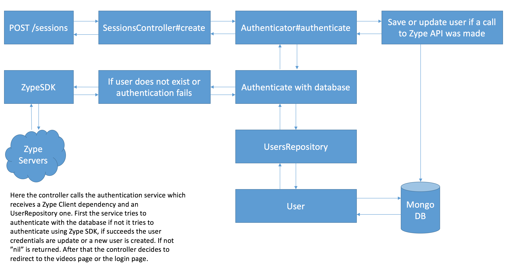

# ZYPER   

To access the example application click [here](https://zyper.herokuapp.com)

---

The **Zyper** application displays videos from the Zype WEB API, if a video required a subscription,
a sign in page will be prompted when trying to access tthis video page.

After the sign in (which is done via Zype WEB API too) the user can see the detailed video page (and of course, for the videos that don't require a subscription, their detailed pages can be accessed without the need to sign in).

## Stack

- Ruby 2.4.2
- Ruby on Rails 5.1
- [Zype SDK](https://github.com/lucasmedeirosleite/zype-sdk)

## Front

- Materialize SASS

## Test

- RSpec
- FactoryGirl
- DatabaseCleaner

## Architecture

The **Zyper** application was built flowwing principles like thin controllers and Domain Driven Design.
Also to uncouple somethings a gem was created just to to the communication with the Zype WEB API, and it's called [zype-sdk](https://github.com/lucasmedeirosleite/zype-sdk).

The application has only four actions which are described below:
 
 
 
 
 
 
 
 
 
 